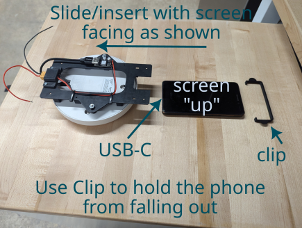
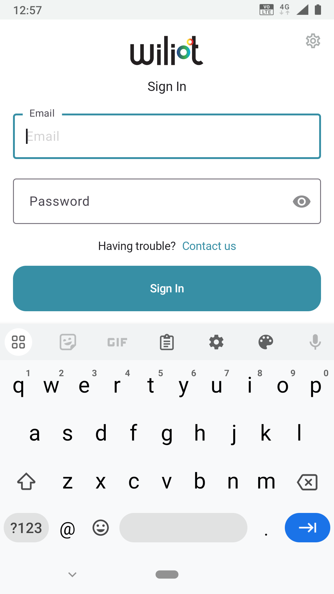
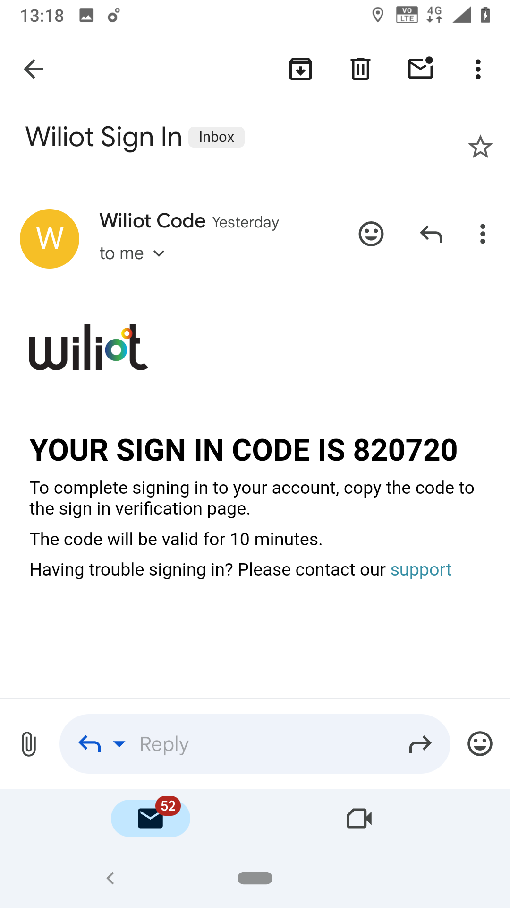
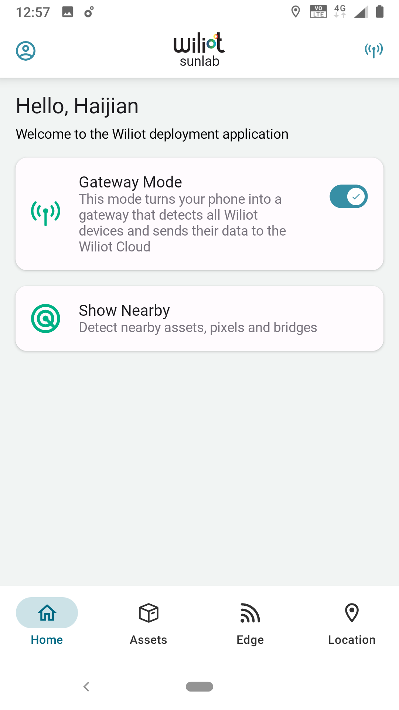

# aerpaw-tag
Project files for a non-canonical aerpaw deployment to power/read wilot tags and manage the aerpaw aerial drone

# The drone will fly according to the plan show below   

   <div style="page-break-after: always"></div>

# A system diagram is given below   

   <div style="page-break-after: always"></div>

# Phone payload loading instructions   
Both the USB-C of the phone and the power for the buck converter should be on the same side.   
Correct installation prevents erroneous phone button pressing during flight.   

   <div style="page-break-after: always"></div>

# Phone gateway-bridge setup
Login with the provided credentials. The credentials are kept within the Google Keep app.  

  <div style="page-break-after: always"></div>
   
(if required) Use the gmail app to fufill two-factor authentication.  

   <div style="page-break-after: always"></div>

Ensure the gateway mode is turned on.  

   <div style="page-break-after: always"></div>   

# Check connectivity via MQTT
You may check if the setup is correct by viewing the data via MQTT.  
Here is a simple webclient setup.   
https://www.hivemq.com/demos/websocket-client/   
Click ```Connect``` (no need to change anything)  

   <div style="page-break-after: always"></div> 

Once connected, click ```Add New Topic Subscription```  

   <div style="page-break-after: always"></div>  

Change the topic to ```sunlab``` and click ```Subscribe```   

   <div style="page-break-after: always"></div>

The first message show, but check to see if it is just a "retained" message.   
A retained mesage does not show current connectivity.   
You should see messages about activity and temperature when the tags are present.  
(eg. The message shown below is an activity message stating that the tag is no longer actively being seen)  

   <div style="page-break-after: always"></div>