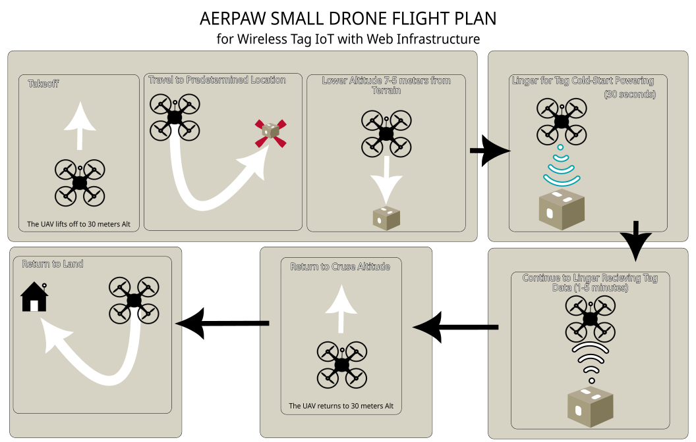
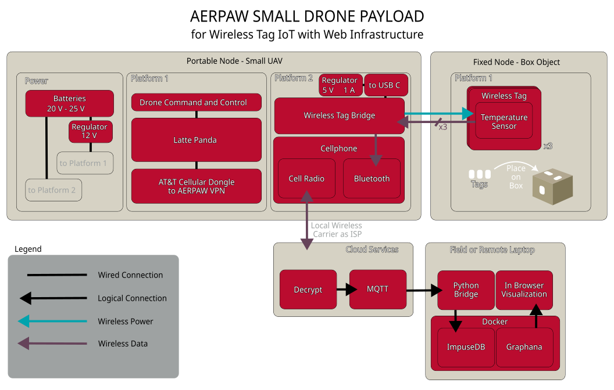

# aerpaw-tag
Project files for a non-canonical aerpaw deployment to power/read wilot tags and manage the aerpaw aerial drone

# The drone will fly according to the plan show below   

   

# A system diagram is given below   

